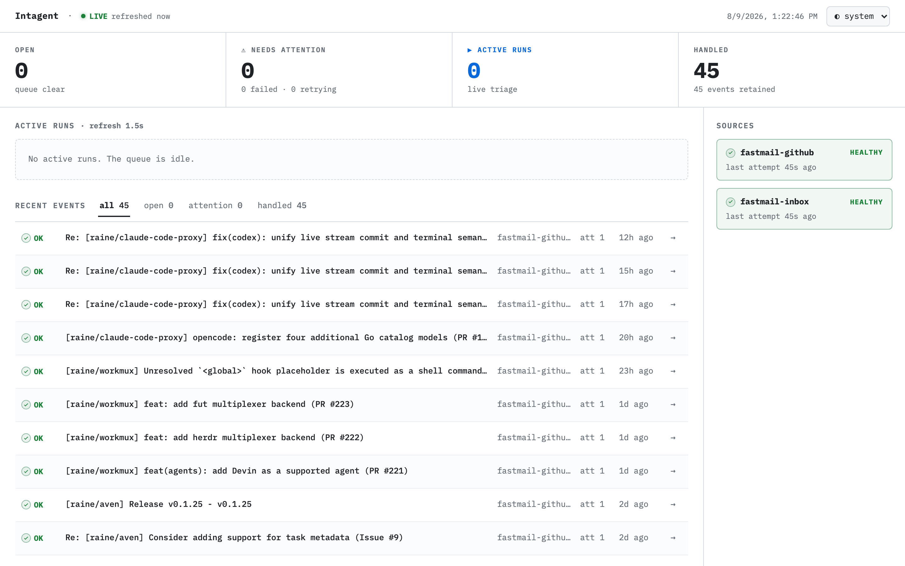
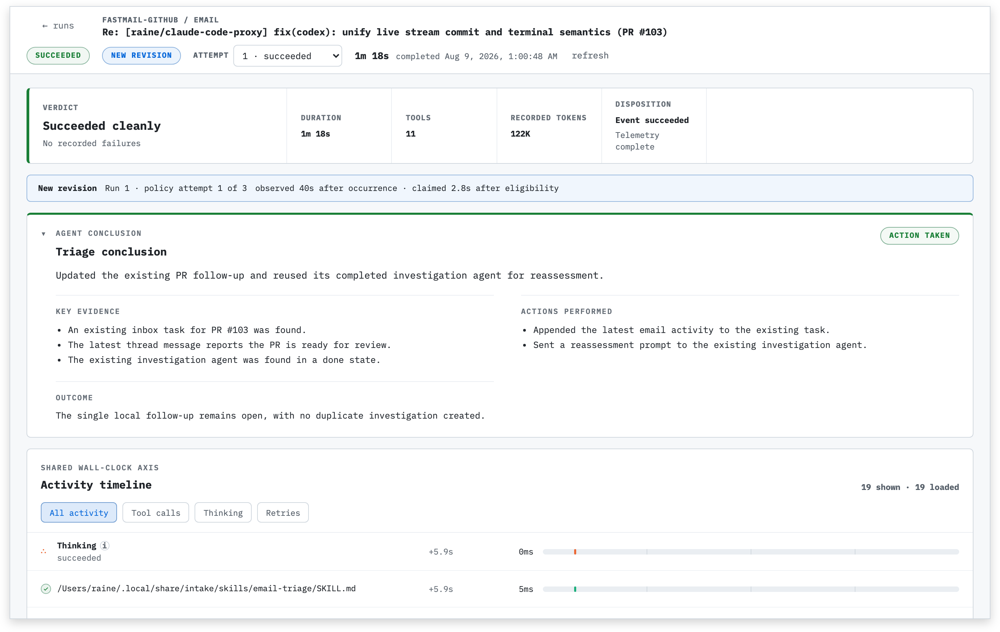

# Intagent

**Your agent for incoming work.**

Intagent is my experimental system for turning incoming emails into local work. It watches
configured sources, runs a restricted triage agent for each event, and decides whether I need to
act.

It's built around my workflow where I use [aven] to manage tasks and [workmux] to run coding agents
in isolated worktrees and tmux windows. This makes the default setup fairly specific to me, but the
pieces are replaceable. Sources communicate through a small JSON protocol, and routing behavior
lives in agent skills. Supporting another mail provider, task manager, or agent runner mostly means
providing a source command and adapting those skills.

<picture>
  <source media="(prefers-color-scheme: dark)" srcset="meta/dashboard-dark.webp">
  <source media="(prefers-color-scheme: light)" srcset="meta/dashboard-light.webp">
  
</picture>

## How it works

Email is the main intake layer. Automated alerts, GitHub notifications etc. all arrive as events
that the triage agent can evaluate.

When something requires action, the agent creates or updates an aven task. If the message warrants
investigation, it starts a workmux agent in the relevant project and places it in that project's
tmux session. I can watch the investigation, inspect its worktree, and continue the agent
conversation when it needs more context or judgment.

Informational messages are recorded without creating unnecessary work. Incoming content is treated
as untrusted data, and outward actions such as sending email, posting comments, pushing code, or
merging changes remain under my control.

<picture>
  <source media="(prefers-color-scheme: dark)" srcset="meta/run-details-dark.webp">
  <source media="(prefers-color-scheme: light)" srcset="meta/run-details-light.webp">
  
</picture>

## Why investigations run locally

The decision to run investigations in tmux locally is deliberate. I don't care about having agents
running in the cloud. It's perfectly fine for them to pick things up when the laptop opens.

This puts the investigation where I want it: in the project's tmux session, alongside everything
else I'm doing. I can watch it, inspect the worktree, and continue the agent conversation when
necessary.

## Setup

Initialize the configuration and private skill directory:

```sh
intagent init
```

The skill directory normally lives at `~/.config/intagent/skills`. Only skills listed in
`skills.directories` are discovered. The installer places example templates in:

```text
~/.local/share/doc/intagent/examples/skills
```

Copy the templates you want into the private skill directory and customize their task manager or
investigation workflow. The included routing templates use aven, but another task manager can be
substituted. Commands required by a skill must also appear in `commands.rules`.

See the [example configuration](examples/config.yaml) for the available settings.

## Usage

Run continuously:

```sh
intagent watch
```

Poll every source once and process the resulting queue:

```sh
intagent check
```

Add `--dashboard` to run the monitor and read-only dashboard in the same process:

```sh
intagent watch --dashboard
```

The dashboard listens on `127.0.0.1:4545` by default. The host and port can be changed:

```sh
intagent watch --dashboard --host 127.0.0.1 --port 8080
```

Binding to a non-loopback host exposes an unauthenticated title and entity API, so it requires an
explicit acknowledgement:

```sh
intagent watch --dashboard --host 0.0.0.0 --allow-non-loopback
```

The dashboard can also run without the monitor or triage queue:

```sh
intagent dashboard --host 127.0.0.1 --port 4545
```

`--config` is a global option and works before or after the command:

```sh
intagent --config ~/intagent/config.yaml watch --dashboard
intagent watch --dashboard --config ~/intagent/config.yaml
```

The first SIGINT or SIGTERM stops source schedules, dashboard serving, and idle queue waits. Active
triage can finish before the process exits. A second signal forces exit status 130.

[aven]: https://github.com/raine/aven
[workmux]: https://github.com/raine/workmux
